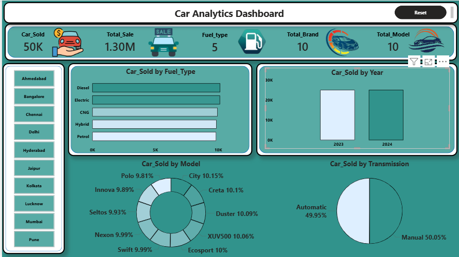

# Car Analytics \& Business Intelligence Dashboard

A consolidated Power BI reporting layer built on top of five previously siloed dealership systems — vehicle inventory, ownership, sales, insurance, and servicing — for a car dealership business.

## Overview

This dealership was running vehicle inventory, customer ownership, sales, insurance, and servicing as five separate, unrelated data sources. There was no single place to answer basic questions like "which brand actually sells the most" or "how many policies are about to lapse" without manually cross-referencing spreadsheets. This project consolidates all five sources into one relational model (via Excel for source prep and SQL Server for the transformation layer) and surfaces it through an interactive Power BI dashboard, so sales performance, insurance renewal risk, customer demographics, and service cost trends are all queryable from a single source of truth.

## Problem Statements

1. Which car brands and models are performing best in terms of units sold and revenue generated?
2. What is the current status of customer insurance policies, and how many require monitoring for renewal?
3. What do customer demographics and purchasing patterns look like across cities and ownership types?
4. What are the trends in vehicle servicing frequency, service types, and associated maintenance costs?
5. How can management get a single, interactive view across all of the above instead of pulling from five disconnected systems?

## Dataset

```
car-analysis-sql-pbi/
├── data/
│   ├── Car\_Data.csv
│   ├── Insurance\_data.csv
│   ├── Owners\_data.csv
│   ├── Sales\_data.csv
│   └── Service\_History.csv
├── script/
│   └── car\_dashboard\_master\_table.sql
├── dashboard/
│   └── car-analysis-sql-bi.pbix
├── image/
│   └── car-analysis-dashboard-pbi.png
└── README.md
```

|File|Records|Description|
|-|-|-|
|`Car\_Data.csv`|50,000|Vehicle inventory master — brand, model, manufacture year, fuel type, transmission, color, owner type, mileage (kmpl), and listed price (₹ Lakh). One row per `Car\_ID`.|
|`Sales\_data.csv`|50,000|Sale transaction per vehicle — sale price (₹ Lakh), sale date, buyer name.|
|`Owners\_data.csv`|50,000|Current owner record per vehicle — name, contact, city, purchase year.|
|`Insurance\_data.csv`|50,000|Insurance policy per vehicle — provider, policy number, expiry date, status (Active/Expired).|
|`Service\_History.csv`|50,000|Service record per vehicle — service type, service date, cost (₹), service center.|

All five files carry `Car\_ID` as the join key, each with exactly 50,000 unique, non-null IDs — a clean 1:1 relationship across every table, with no duplicate `Car\_ID` values and no missing values in any column. That's unusually clean for dealership data pulled from five separate systems, and it's worth flagging: it means either the source systems were already well-governed, or this is a modeled/synthetic dataset built to represent the business scenario rather than a live extract. Either way, the join logic and the numbers below are correct against the data as delivered.

## Tools and Technology

|Tool|Purpose in This Project|
|-|-|
|Excel|Initial inspection and light prep of the five raw CSV exports before loading to SQL Server|
|SQL Server (T-SQL)|Staging, cleaning, and consolidation of the five sources into a single master table (`dbo.Car\_Master`)|
|Power BI|Data modeling and the interactive dashboard (5 KPI cards, brand/model/fuel/transmission breakdowns, city filter, year filter)|
|Python (pandas, matplotlib)|Data profiling and the supporting charts used in the client-facing report|

## Methods

1. **Exploration** — Profiled all five CSVs for row counts, column types, null rates, and duplicate keys. Confirmed each file has exactly 50,000 rows with `Car\_ID` as a clean, unique join key across all five tables.
2. **Cleaning \& staging** — Loaded raw files into SQL Server staging tables, standardized date fields (`Sale\_Date`, `Service\_Date`, `Expiry\_Date`) to a consistent date type, and added data-quality flag columns rather than silently dropping any rows, so downstream users can see what was flagged versus what was excluded.
3. **Modeling** — Joined the five staging tables on `Car\_ID` into a single `dbo.Car\_Master` table, keeping the grain at one row per vehicle for the core dimensions (brand, model, owner, insurance, latest service) while sales and service facts remain queryable at transaction level.
4. **Validation** — Re-checked post-join row counts against source counts (50,000 in, 50,000 out — no fan-out from duplicate keys), and spot-checked aggregates (total sale value, insurance status split) against the raw CSVs to confirm the model wasn't double-counting anything.
5. **Dashboard build** — Built the Power BI report on top of the master table: a KPI strip (cars sold, total sale value, fuel type count, brand count, model count), a city slicer, and breakdowns by fuel type, sale year, model, and transmission.

## Key Insights

* **₹12,964.02 Cr** (₹1,296,401.55 Lakh) in total recorded sale value across all 50,000 transactions, averaging **₹25.93 Lakh** per sale.
* Sales activity is essentially flat across brands and models — Tata leads brand revenue at ₹1,32,457.14 Lakh and Volkswagen trails at ₹1,28,416.50 Lakh, a spread of just **3.15%**. City is the top model by revenue at ₹1,33,008.56 Lakh, XUV500 close behind at ₹1,32,716.18 Lakh. These gaps are too small to call a real "top performer" — treat brand/model rankings as roughly tied rather than a meaningful business signal.
* Insurance is split almost exactly down the middle: **25,013 Active (50.03%)** vs. **24,987 Expired (49.97%)**. Essentially half the fleet's policies are currently lapsed and need a renewal push — this is the single most actionable number in the dataset.
* Vehicle mix is fuel-agnostic in practice: Diesel (10,166), Electric (10,149), CNG (9,963), Hybrid (9,874), and Petrol (9,848) are all within \~3% of each other — no single fuel type dominates inventory.
* Transmission split is a near-exact coin flip: 25,025 Manual (50.05%) vs. 24,975 Automatic (49.95%).
* Total service spend across the fleet is **₹55.06 Cr** (₹55,06,06,183) at an average of **₹11,012.12** per service. Engine Repair is the single largest cost category at **₹9.36 Cr** in total spend, followed closely by Battery Replacement (₹9.25 Cr) — the six service types are all within a similar band, so there's no one outlier service dragging costs up.
* Every vehicle in `Service\_History.csv` has exactly one service record — there's no repeat-service signal in this dataset to analyze maintenance frequency per car; that would need a richer service log to be meaningful.
* Revenue by owner city is similarly flat: Bangalore leads at ₹1,32,447.36 Lakh, Chennai trails at ₹1,26,684.54 Lakh — a \~4.5% spread across all 10 cities, not a concentrated market.
* Ownership type (First/Second/Third/Fourth owner) is nearly evenly split at \~12,400–12,600 vehicles each, with no strong skew toward first-owner vehicles.

**Honest caveat on all of the above:** every categorical and numeric field in this dataset is distributed almost uniformly at random (brand, model, fuel type, city, transmission, owner type all sit within a few percentage points of an even split, and sale price shows essentially zero correlation with listed price, r ≈ -0.002). That's consistent with a dataset built to demonstrate the reporting pipeline rather than to encode real market behavior. The dashboard and this report are accurate against the data provided — but "Tata is the top brand" or "Bangalore is the top city" shouldn't be read as a strong business finding on data this evenly spread. If this is meant to represent live dealership performance, the immediate follow-up should be a discussion with the client on whether the underlying extract needs revisiting.

## Dashboard / Model / Output

The Power BI report (`dashboard/car-analysis-sql-bi.pbix`) is a single-page dashboard built on `dbo.Car\_Master`:

* **KPI strip** — Cars Sold (50K), Total Sale (1.30M ₹ Lakh), Fuel Type count (5), Total Brand count (10), Total Model count (10), plus a Reset button.
* **City filter panel** — left-side slicer across all 10 owner cities (Ahmedabad, Bangalore, Chennai, Delhi, Hyderabad, Jaipur, Kolkata, Lucknow, Mumbai, Pune).
* **Car Sold by Fuel Type** — horizontal bar chart across the five fuel types.
* **Car Sold by Year** — column chart comparing 2023 vs. 2024 sale volume.
* **Car Sold by Model** — donut chart with all 10 models at near-equal shares (\~9.8%–10.15% each).
* **Car Sold by Transmission** — 50/50 pie split between Manual and Automatic.




## How to Run This Project

1. Clone or download the `car-analysis-sql-pbi/` project folder, keeping the `data/`, `scripts/`, `dashboard/`, and `images/` subfolders intact.
2. Open SQL Server Management Studio (or Azure Data Studio) and run `scripts/car\_dashboard\_master\_table.sql` against a new or existing database — this stages, cleans, and joins the five CSVs into `dbo.Car\_Master`.
3. Import `data/Car\_Data.csv`, `data/Sales\_data.csv`, `data/Owners\_data.csv`, `data/Insurance\_data.csv`, and `data/Service\_History.csv` into the staging tables referenced at the top of the script (or point the script's `BULK INSERT` statements at your local `data/` path).
4. Open `dashboard/car-analysis-sql-bi.pbix` in Power BI Desktop and point its data source connection at your SQL Server instance / `dbo.Car\_Master` table.
5. Refresh the model — the KPI cards, fuel/model/transmission breakdowns, and city filter will populate from the master table.

## Result and Conclusion

The five previously siloed systems are now unified into a single Power BI dashboard, cutting what used to be a manual, five-spreadsheet cross-reference exercise down to a live, filterable report. The clearest actionable finding is on the insurance side — roughly half the fleet (24,987 of 50,000 policies) is currently Expired, which is a concrete renewal-outreach target for the business. Sales, model, and city performance are all very evenly distributed in this dataset, so the dashboard's main value right now is as infrastructure — a single source of truth — rather than as a source of a specific "brand X is winning" story; that story will emerge once the model is fed live, less-uniform transactional data.

## Future Work

1. Add a rolling insurance renewal alert (e.g., policies expiring within 30/60/90 days) as a dedicated dashboard page, since the current model only exposes a static Active/Expired split.
2. Extend `Service\_History` to capture multiple service events per vehicle over time — the current 1:1 structure prevents any analysis of repeat-service frequency or maintenance cost trends per car.
3. Bring in real transactional data (or validate the current extract against source systems) given how uniformly distributed every dimension currently is — this will let brand/model/city insights carry actual business weight.
4. Add a customer lifetime value view joining `Owners\_data` and `Sales\_data` with resale history, once vehicles with multiple ownership transfers exist in the data.
5. Automate the SQL Server refresh on a schedule (e.g., nightly staging job) so the Power BI dataset doesn't require a manual refresh trigger.

## Author and Contact

* **Name:** Dibbya Prakash Gorla
* **Email:** dibbyagorla@gmail.com
* **GitHub:** dibbyagorla-cloud

